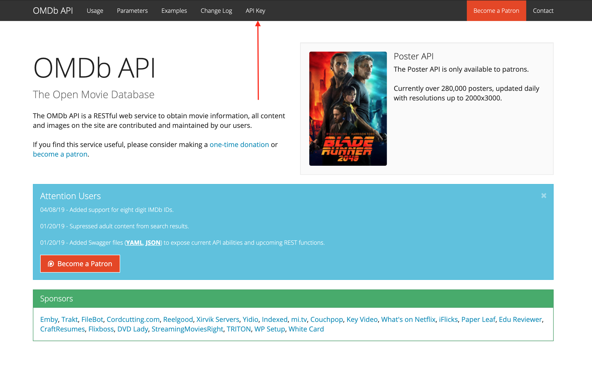
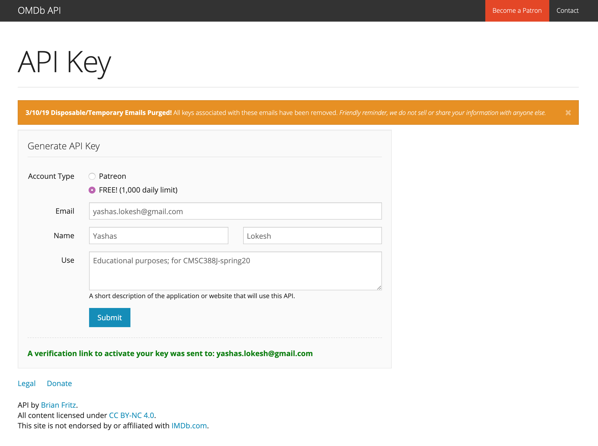
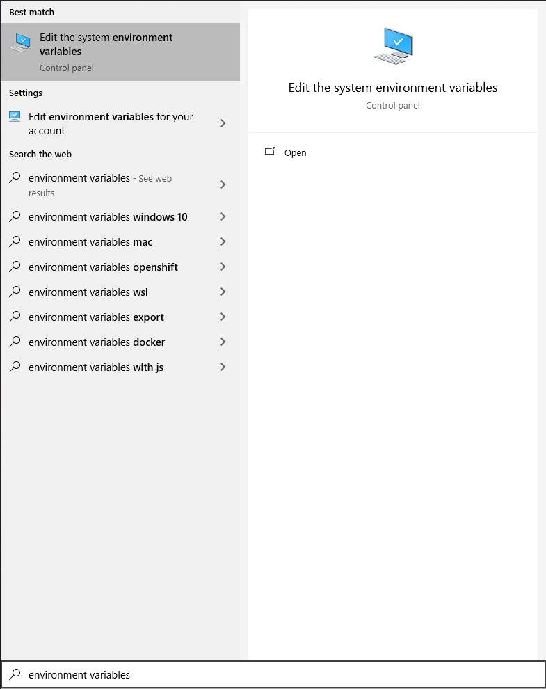
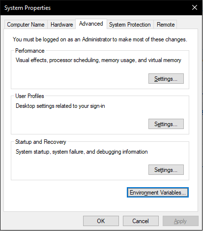
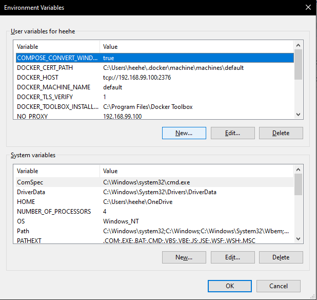
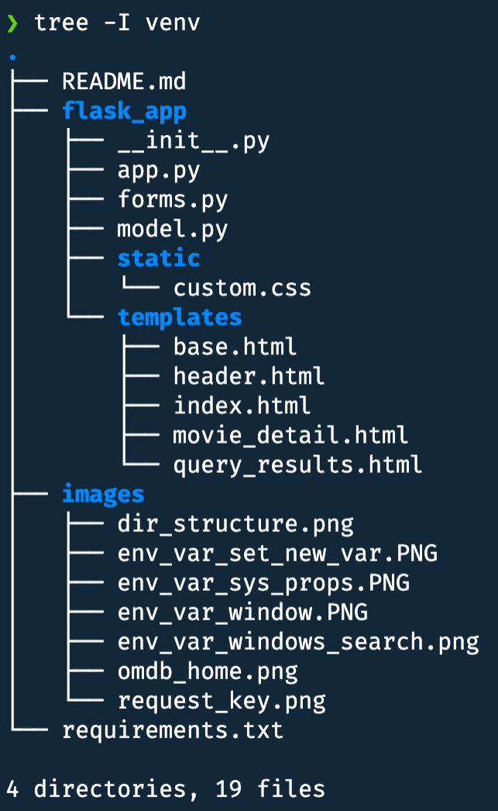

# P3: Movie Ratings Database

**Assigned**: Week 4, September 23rd, 2020

**Due**: Week 6, October 6th, 2020, 11:59 PM

**Late Deadline**: Refer to syllabus for the policy.

## Description

You will be constructing the forms and database-accessing parts of a movie rating
website so that users can search for movies and leave reviews for the world to see.

You *may* add more fields to the models if you want. You just have to include
the required fields, as detailed below.

**Note:** On the slides, we taught you to check if the `request.method == 'POST'` and then
to check if the form can be validated with `if form.validate()`. However, using this
approach will not allow the error messages to show up.

To get the error messages to show up, use `if form.validate_on_submit()` to check
that the form was submitted and to validate it in one step. This allows you to
display any errors that are thrown by the custom or built-in validators 
from your forms. 

**Side Note:** The OMDB API returns movies *and* TV shows. You don't have to worry
about distinguishing between types of media. Just to alleviate any concerns. :)

## Setup

Activate your virtual environment and use
`pip3 install -r requirements.txt` or
`pip3 install Flask Flask-WTF Flask-PyMongo python-dotenv requests`.

The setup involves getting an API key, setting it to an environment variable on your system, 
and installing the necessary packages. 

You must use your API key by setting an environment variable. While it is possible to
paste it directly in the code, we strongly advise against doing that, as it is a security hazard.
We should not be able to see your API key in your submitted files, but we should be able to
run your code with our own API keys. 

You may set the environment variable for your API key each time you open a shell, but that's
also tedious to do, so we've included instructions here on how to set environment variables
permanently on your system (until you remove them, of course).

### Setup (OMDb):
1. Navigate to The Open Movie Database website -- http://www.omdbapi.com/
   
2. Request an API key and navigate to the email you used to sign up with OMDb, and
   verify your API key.
   
3. Using the API key you received in your email, set the environment variable
   `OMDB_API_KEY` on your system, so that the `MovieClient` script executes without error.

### Setting permanent environment variables (Unix)
1. If you're on macOS Catalina, then you have the `zsh` shell in your Terminal by default. If
   you're on a Linux distribution, then you mostly likely have `bash`, but the instructions
   still apply. **To determine which shell you're using,** use this command: `echo "$SHELL"`.
   (If you're using `fish`, you probably know how to set environment variables already)
2. Open the the `~/.bashrc` or `~/.zshrc` for modification using your favorite text editor (nano
   works perfectly fine for this, we're adding one line.)
3. Somewhere in the file, preferably at the end so you can easily find it, type
   `export OMDB_API_KEY={your_key_here}`, with your own key, *without the braces*.
   You don't need quotes around the API key. Restart your shell application if you haven't
   already, and your environment variable should be set. You can use the command
   `env | grep "OMDB_API_KEY"` in your shell to check if it is.
4. (Optional) After the project, you can remove the API key from your system by deleting
   the relevant snippet in `~/.bashrc` or `~/.zshrc`.

### Setting permanent environment variables (Powershell)
1. Search for "environment variables" in the Windows start menu  
     
2. Click on the "Environment Variables..." button  
     
3. Click on the "New..." button under "User Variables for <self>"  
     
4. Enter the desired environment variable name (`OMDB_API_KEY`) under "Variable name"
   and your key under "Variable value"  
     

You must use your API key by setting environment variables. We can't enforce it, but please don't
paste the key into your code.

To create your virtual environment, be in the `p3/` directory and use
the correct command to create a virtual environment folder named `venv`. To activate it,
use the appropriate command for your system (if you're having trouble
figuring out how to activate your environment, contact us and include a 
screenshot of the `venv` directory structure).
Then, to install the necessary packages, run `pip3 install -r requirements.txt`.

This week we'll be using the `requests`, `Flask`, `Flask-WTF`, and `Flask-PyMongo` libraries.

## Project

This is the `p3/` directory structure

**Only modify:** `app.py` and `forms.py`. 

There's a README, this document, containing your instructions to complete the project. The
`images/` folder consists of images used in the README, so it is not anything
you have to worry about while implementing your project. `requirements.txt` contains
all of the packages you should have installed (with `pip3 install -r requirements.txt`).

The `flask_app/` directory contains `app.py`, where all of your view functions and app setup
are located, `forms.py`, containing the two forms you will have to implement, `model.py`,
which provides two classes: `Movie` and `MovieClient`, which is how you'll interact with the
OMDb API, a `static/` folder consisting of custom CSS (don't worry about this), and
`templates/`, consisting of all templates you'll use for this project. 

First, we'll explain `model.py`:
- `model.py` consists of two classes. One is a `Movie` class, the other `MovieClient`.
- The `MovieClient` class is instansiated with an API key (don't worry about this
  once you've set your environment variable), and it has two methods for you to use:
  - `search()` takes a `search_string` that the user entered into the search box
    on the index page, and it returns a `list` of `Movie` objects. If an error
    occurs, a `ValueError` will be raised with the error message.
  - `retrieve_movie_by_id()` takes an `imdb_id` and returns a `Movie` object with more data
    on that particular movie. If an error occurs, a `ValueError` will be raised
    with the error message.
- The `Movie` class consists of up to 10 attributes. If a detailed movie request is made, then
  it contains all 10. Otherwise, if just being searched for using `MovieClient.search()`, it will
  have the basic 5 attributes (title, year, imdb_id, type, poster_url).

Here's what you need to do for this project, file by file:
1. `app.py`:
   - Set the database and secret keys, so that Mongo works and the CSRF tokens
      can be generated. 
   - Use **MongoDB** to store the reviews that have been submitted. Not using MongoDB
     (if you use SQLite or some other database, or the `session` object), will result in a 0.
   - In `query_results(query)`, you'll need to use the `MovieClient` class to search 
     movies matching `query`. If an error is encountered,
     the error message should be displayed, and no query results. If the search is
     successful (list of `Movie`s returned), then display those Movies (the template
     is taken care of)
   - In `movie_detail(movie_id)`, use the `MovieClient` class to get a detailed
     view of the movie identified by `movie_id`. If it has a retrieval error, 
     show the error message. If no error, then create the MovieReviewForm. Then 
     if `validate_on_submit()` is true, store the movie review with 
     **4 parameters: `imdb_id`, `commenter`, `content`, and `date`**. You can store
     the data into any collection, but make sure you're keeping track of collections.
     That said, we require you **use one collection for all reviews.**
     After successful storing, redirect so the user can see their published review. 
   - Additionally in `movie_detail(movie_id)`, all of the reviews that users have submitted
     for that movie must be displayed. The template takes care of displaying, you have to
     provide the data.
   - **Note:** There is a `current_time()` function at the bottom of `app.py` that returns
     the current date and time as a neatly-formatted string.
   - **Second note:** To determine what parameters to pass in to templates, inspect the templates.
2. `forms.py`:
   - Create the two forms `SearchForm` and `MovieReviewForm`.
   - `SearchForm` has a text-box for entering a query, and a submit button. Check out
     the `index()` view function and the `index.html` template
     to see what the form elements should be named.
     The query should be at least 1 character long, but no more than 30.
   - `MovieReviewForm` has a text-box for a commenter to enter their name or an alias, and
     a larger text area for a commenter to type out the full content of their post, along
     with a button for submission. A name should be at least 1 character long, no more than 50, and the content of a comment
     should be at least 1 character, but no more than 500. 
     The names for these fields can be determined by looking at the `movie_detail.html` template.

**Hint for MovieReviewForm:** You should use a field that allows multi-line input.

## Testing

Please make sure you haven't modified the template files.

When your current directory is `flask_app/`, you can simply run the command `flask run`
in your terminal or command line to see your website.

Make sure the index page shows up, and that you can enter queries for movies in the form.
If any errors occur while querying, the error message should be shown on the query page.
If no errors occurred, we should see a list of movie posters and titles. For exmaple, searching
`guardians` yields 113 results. Then clicking on one of these titles should take us to
the detail page. Here we see lots of extra information on the movie in a card at the top,
and we should see all the reviews users left below that, and then the form for submitting
reviews below that. If the movie detail retrieval fails, the error message for the failure should 
be displayed, without any of the reviews or the form being displayed.

The navbar header should take you back to the main page, where you can search for more movies.

**We will be** releasing a demo video within the next couple of days.

## Submissions

Assure that you've tried out all the different things that could go wrong and that they
are behaving appropriately (and the things that are supposed to work, still do).

**The directory, along with its contents, should be zipped, not the contents of the directory.**
In other words, when we unzip your file, we should see the `flask_app/` directory. If you
have any questions on how to submit, please contact us.

If you don't submit according to the instructions above, you may lose **up to 25%** of your
score on this project.

After zipping, submit the zip file to the appropriate ELMS page. No test results will be shown.

## Grading

No test results will be shown when you submit on ELMS.

If you don't use MongoDB, you will get a 0 on this project.

Your project will be graded on (1) correctness and (2) robustness.
Here are the **correctness** requirements:

**Correctness**:

| Requirement                                                                        | Points |
| ---------------------------------------------------------------------------------- | ------ |
| Secret key set                                                                     | 5      |
| Reviews are shown per movie (unique per movie)                                     | 15     |
| Queries are shown when media is searched up                                        | 15     |
| Reviews are persisted through app lifetime                                         | 15     |
| Reviews are persisted when app is closed and restarted (across multiple lifetimes) | 15     |
| Forms have the correct names and validators                                        | 10     |
| Form fields are all rendered, errors are shown when validation fails               | 10     |
| Validation errors displayed on page when validation fails                          | 10     |
| `MovieReviewForm` has multi-line input for review                                  | 5      |
| Show reviews for movie after form submitted successfully.                          | 10     |

There's a total of 110 points.

**Robustness:**

Refer to the syllabus for the robustness requirement for all projects.
The syllabus has been updated recently with this information, since
it will be common to all projects.
